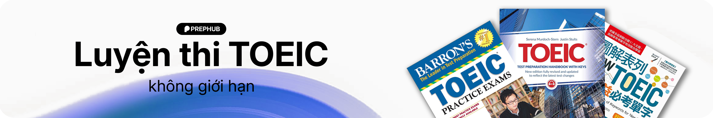

  <h1 align="center">PrepHub</h1>
  
<b>Nền tảng test các kỹ năng TOEIC online nhanh chóng, tiện lợi</b>

  
  
  
  
  
  
  
  <!-- <a href="#">Khám phá trang chủ »</a> -->
  
  
  
<i>Đồ án cuối kì môn học Phát triển ứng dụng web - IS207 - UIT 2025-2026</i>

  

  

> [!WARNING]
> **Đây chỉ là dự án nhằm mục đích học tập, là đồ án cuối kì của một môn học**  
> Dự án không nhằm mục đích thay thế bất cứ sản phẩm nào

  
<b>Mục lục</b>

  <ol>
    <li><a href="#thành-viên">Thành viên</a></li>
    <li><a href="#giới-thiệu-môn-học">Giới thiệu môn học</a></li>
    <li><a href="#tài-liệu">Tài liệu</a></li>
    <li><a href="#lời-cảm-ơn">Lời cảm ơn</a></li>
  </ol>

---

## Thành viên
Danh sách thành viên của **Nhóm 2**

| MSSV     | Họ và tên          | 
| -------- | ------------------ | 
| 24520231 | Lê Bửu Chương      | 
| 24520560 | Nguyễn Trọng Hoàng | 
| 24521234 | Nguyễn Đức Nhân    | 
| 23520689 | Lê Nguyên Khang    |
| 24520529 | Đinh Lê Huy Hoàng  |

<!-- 

  <table>
    <tr>
      <td align="center" valign="top" width="14.28%"><a href="https://github.com/ChuongLe279"> <b>Lê Bửu Chương</b></a> </td>
      <td align="center" valign="top" width="14.28%"><a href="https://github.com/versenilvis"> <b>Nguyễn Trọng Hoàng</b></a> 
      <td align="center" valign="top" width="14.28%"><a href="https://github.com/Nhan-1234"> <b>Nguyễn Đức Nhân</b></a> </td>
      <td align="center" valign="top" width="14.28%"><a href="https://github.com/kstuv"> <b>Lê Nguyên Khang</b></a> </td>
      <td align="center" valign="top" width="14.28%"><a href="https://github.com/chanbidu"> <b>Đinh Lê Huy Hoàng</b></a> </td>
    </tr>
  </table>

 -->

<!--
 
-->

## Giới thiệu môn học
- Tên môn học: Phát triển ứng dụng Web
- Mã môn học: IS207
- Mã lớp: IS207.Q23
- Năm học: HK2 (2025 - 2026)
- Giảng viên: Trình Trọng Tín

## Tài liệu
Tài liệu bao gồm cả tài liệu source code cũng như các tài liệu khác về việc quản lí của nhóm, các hướng dẫn, quản lí các task, ...  
Ngoài ra các bạn cũng có thể tham khảo cách bọn mình làm việc và chia việc

Chi tiết [tại đây](./docs)

## Lời cảm ơn
Chân thành cảm ơn thầy cùng các bạn đã hỗ trợ dồ án trong quá trình học tập và làm việc. 
Cũng như cảm ơn sự nỗ lực của tất cả thành viên trong nhóm 5 người. 
Rất mong nhận được sự đặt câu hỏi và góp ý từ thầy cùng các bạn để dự án hoàn thiện hơn!

